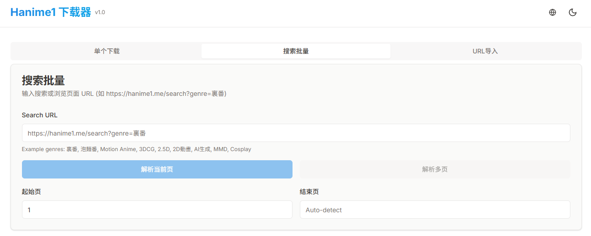

<div align="center">

# Hanime1 Downloader


**中文** | [English](README_EN.md)

现代化异步视频下载器，支持 [hanime1.me](https://hanime1.me)，带可视化 WebUI。



</div>

- **🚀 高性能**: 基于 Playwright + httpx + asyncio 异步架构，极致速度。
- **🎨 现代化 UI**: 全新 React + TailwindCSS 界面，支持深色模式、多语言 (中/英)。
- **🔍 强大搜索**: 支持关键字/类别搜索、分页解析 (自动识别总页数)、批量选择下载。
- **📦 批量导入**: 支持批量粘贴 URL 或上传 `.txt` 文件导入下载任务。
- **🛠️ 功能丰富**: 支持多分辨率 (360p-1080p)、本地封面缓存、断点续传。

## 📦 快速开始

本项目使用 [uv](https://docs.astral.sh/uv/) 进行依赖管理。需要 Python 3.13+。

### 1. 一键安装

自动安装 uv、Playwright 及所有依赖。

- **Windows (CMD/PowerShell)**:
  ```cmd
  .\setup.bat
  ```
  _或者 PowerShell: `.\setup.ps1`_

- **Linux / macOS**:
  ```bash
  chmod +x setup.sh run.sh
  ./setup.sh
  ```

### 2. 启动服务

- **Windows**: `.\run.bat`
- **Linux / macOS**: `./run.sh`

启动后访问: [http://127.0.0.1:8000](http://127.0.0.1:8000)

### 3. dev 开发模式

#### 后端
```bash
# 启动后端 API 服务 (端口 8000)
uv run python hentai/main.py
```

#### 前端
```bash
cd frontend
# 安装依赖
npm install
# 启动开发服务器 (端口 5173)
npm run dev
```

### 4. 构建发布
```bash
cd frontend
npm run build
# 构建完成后，后端会自动服务 frontend/dist 目录下的静态文件
```

## 🔧 配置 (`hentai/config.py`)

- **ScraperConfig**: Headless 模式 (`headless=True`/`False`)
- **DownloadConfig**: 并发数 (`max_concurrent_downloads`)、代理 (`use_proxy`)
- **WebUIConfig**: 端口 (`port`，默认 8000)

## 📁 目录结构

- `hentai/main.py`: 入口文件
- `hentai/core/`: 核心逻辑 (爬虫、下载器)
- `frontend/`: 前端源代码 (React/Vite)

## ☕ Buy me a coffee

如果您觉得这个项目对您有帮助，可以请作者喝杯咖啡 ☕

<div align="center">
  <table>
    <tr>
      <td align="center" width="200">
        
        <br />
        <strong>微信支付</strong>
      </td>
      <td align="center" width="200">
        
        <br />
        <strong>支付宝</strong>
      </td>
    </tr>
  </table>
</div>

## ⚠️ 免责声明

本项目仅供技术学习和交流使用，请勿用于非法用途。
1. 本项目所提供的功能仅用于个人备份或学习研究。
2. 使用本项目所产生的一切后果由使用者自行承担，作者不承担任何法律责任。
3. 请遵守所在国家或地区的法律法规，尊重版权。
4. 如果本项目侵犯了您的权益，请联系作者删除。

## 📝 许可证

[MIT License](LICENSE)