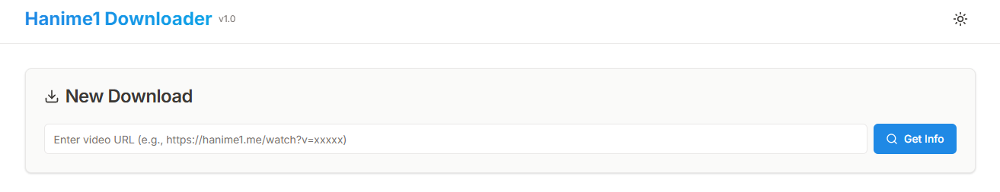

# Hanime1 Downloader v1.0

现代化异步视频下载器，支持 [hanime1.me](https://hanime1.me)，带可视化 WebUI。



## ✨ 特性

- **高性能**: Playwright + httpx + asyncio 异步架构
- **WebUI**: 现代化管理面板，支持实时监控、断点续传、并发控制
- **功能**: 支持多分辨率 (360p-1080p)、WebSocket 实时推送

## 📦 快速开始

本项目使用 [uv](https://docs.astral.sh/uv/) 管理。需 Python 3.13。

### 1. 一键安装

自动安装 uv、Playwright 及所有依赖。

- **Windows (CMD/PowerShell)**:
  ```cmd
  .\setup.bat
  ```
  _或者 PowerShell: `.\setup.ps1`_

- **Linux / macOS**:
  ```bash
  chmod +x setup.sh run.sh
  ./setup.sh
  ```

### 2. 启动服务

- **Windows**: `.\run.bat`
- **Linux / macOS**: `./run.sh`

启动后访问: [http://127.0.0.1:8000](http://127.0.0.1:8000)

## � 配置 (hentai/config.py)

- `ScraperConfig`: Headless 模式 (`headless=True`/`False`)
- `DownloadConfig`: 并发数 (`max_concurrent_downloads`)、代理 (`use_proxy`)
- `WebUIConfig`: 端口 (`port`，默认 8000)

## 📁 目录结构

- `hentai/main.py`: 入口
- `hentai/core/`: 核心逻辑 (爬虫、下载器)
- `hentai/web/`: 前端资源

## 📝 许可证

[MIT License](LICENSE)