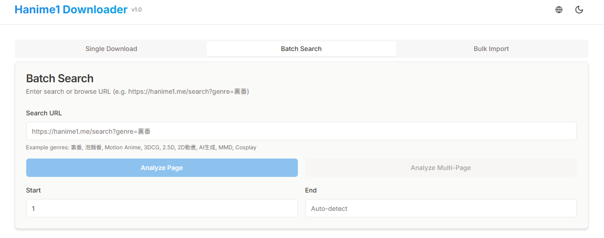

<div align="center">

# Hanime1 Downloader


[中文](README.md) | **English**

A modern asynchronous video downloader for [hanime1.me](https://hanime1.me) with a beautiful WebUI.



</div>

- **🚀 High Performance**: Built with Playwright + httpx + asyncio for maximum speed.
- **🎨 Modern UI**: Brand new React + TailwindCSS interface, supports Dark Mode and i18n (English/Chinese).
- **🔍 Powerful Search**: Support Keyword/Genre search, Pagination (Auto detect total pages), and Batch Selection.
- **📦 Batch Import**: Support pasting multiple URLs or uploading `.txt` files for batch downloading.
- **🛠️ Feature Rich**: Multi-resolution support (360p-1080p), Local Cover Cache, Resume capabiltiy.

## 📦 Quick Start

This project uses [uv](https://docs.astral.sh/uv/) for dependency management. Requires Python 3.13.

### 1. One-Click Setup

Automatically installs uv, Playwright, and all dependencies.

- **Windows (CMD/PowerShell)**:
  ```cmd
  .\setup.bat
  ```
  _Or via PowerShell: `.\setup.ps1`_

- **Linux / macOS**:
  ```bash
  chmod +x setup.sh run.sh
  ./setup.sh
  ```

### 2. Start Server

- **Windows**: `.\run.bat`
- **Linux / macOS**: `./run.sh`

Access WebUI at: [http://127.0.0.1:8000](http://127.0.0.1:8000)

### 3. Development Mode

#### Backend
```bash
# Start Backend API (Port 8000)
uv run python hentai/main.py
```

#### Frontend
```bash
cd frontend
# Install dependencies
npm install
# Start Dev Server (Port 5173)
npm run dev
```

### 4. Build for Production
```bash
cd frontend
npm run build
# After build, backend will automatically serve static files from frontend/dist
```

## 🔧 Configuration (`hentai/config.py`)

- **ScraperConfig**: Headless mode (`headless=True`/`False`)
- **DownloadConfig**: Concurrency (`max_concurrent_downloads`), Proxy (`use_proxy`)
- **WebUIConfig**: Port (`port`, default 8000)

## 📁 Directory Structure

- `hentai/main.py`: Entry point
- `hentai/core/`: Core logic (Scraper, Downloader)
- `frontend/`: Frontend source (React/Vite)

## ☕ Buy me a coffee

If you find this project helpful, you can buy the author a coffee ☕

<div align="center">
  
  
</div>

## 📝 License

[MIT License](LICENSE)
